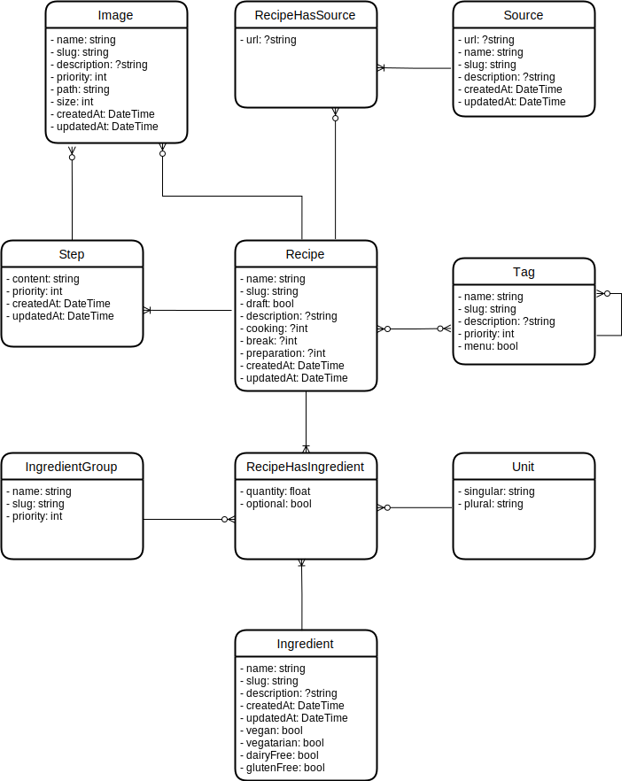

# Projet recettes - API

Ce projet, développé en Symfony et utilisant API Platform, est une API permettant de gérer le stockage et la consultation de recettes et des données attenantes. 
Ses données seront consommées par une autre application (le Front), développée par ailleurs (et dont le lien sera mis ici quand le projet sera démarré).

## Présentation

En vidéo :

Ce projet est principalement à but pédagogique et demeure gratuit d'utilisation, de copie, de modification, etc. Il est également fourni en l'état, avec ses spécificités, ses bugs (même si on essaie de les éviter ;) ) et pour une utilisation précise.

Vous pouvez bien entendu y participer, *via* des <abbr title="Pull Requests">PR</abbr>, commentaires (sur les PR, sur les vidéos, etc.), le forker (créer votre propre projet à partir de celui-ci, voir [le bouton `Fork` en haut du repository](https://github.com/Drakolab-yt/recettes-api)) ou autres moyens.

## Documentations

L'ensemble des éléments de documentation sont rangés dans [le dossier docs/](./docs). Vous trouverez néanmoins les éléments utiles au quotidien ci-dessous.

### Le [schéma d'entités](./docs/mcd.svg)

## Les vidéos associées

Toutes les vidéos sont regroupées dans [une playlist dédiée au projet, sur Youtube](https://www.youtube.com/watch?v=7lLjwkQUhhM&list=PLOOzTDicdX42xpYBIddIAUcoPDzRQc256&index=1)